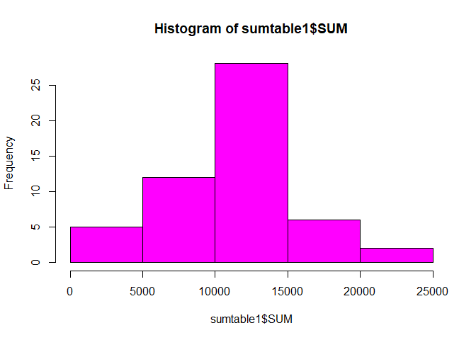
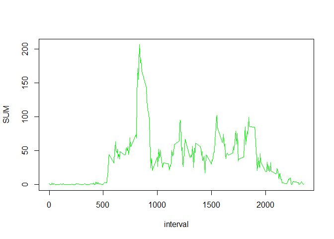

#Loading and preprocessing the data  
# Zip file download from coursera and unzip in the working directory.  


```r
temp <- tempfile()
download.file("https://d396qusza40orc.cloudfront.net/repdata%2Fdata%2Factivity.zip",temp)
unzip(temp)
unlink(temp)
df1<-read.csv("activity.csv")
```
  
#What is mean total number of steps taken per day?

## 1.Calculation of total number of steps taken per day


```r
library(readr)
library(dplyr)
```

```
## 
## Attaching package: 'dplyr'
```

```
## The following objects are masked from 'package:stats':
## 
##     filter, lag
```

```
## The following objects are masked from 'package:base':
## 
##     intersect, setdiff, setequal, union
```

```r
sumtable<- df1 %>% group_by(date)%>%
                  filter(!is.na(steps))%>% 
                  summarise(SUM=sum(steps))
```

## 2. Histogram of total number of steps taken each day.

```r
hist(sumtable$SUM,col="magenta")
```

<!-- -->

## 3.Calculate and report the mean and median of the total number of steps taken per day  

```r
summary(sumtable)
```

```
##      date                SUM       
##  Length:53          Min.   :   41  
##  Class :character   1st Qu.: 8841  
##  Mode  :character   Median :10765  
##                     Mean   :10766  
##                     3rd Qu.:13294  
##                     Max.   :21194
```

#What is the average daily activity pattern?  

## 1. Time series plot (i.e. \color{red}{\verb|type = "l"|}type = "l") of the 5-minute   interval (x-axis) and the average number of steps taken, averaged across all days (y-axis).


```r
st1<-df1 %>% group_by(interval)%>%
  filter(!is.na(steps))%>% 
  summarise(SUM=mean(steps))
plot(st1,type="l",col="green")
```

<!-- -->

## 2. Which 5-minute interval, on average across all the days in the dataset, contains the maximum number of steps?

```r
st1%>% top_n(1,SUM)
```

```
## # A tibble: 1 × 2
##   interval   SUM
##      <int> <dbl>
## 1      835  206.
```

#Imputing missing values  


## What is mean total number of steps taken per day?


## What is the average daily activity pattern?


## Imputing missing values


## Are there differences in activity patterns between weekdays and weekends?
