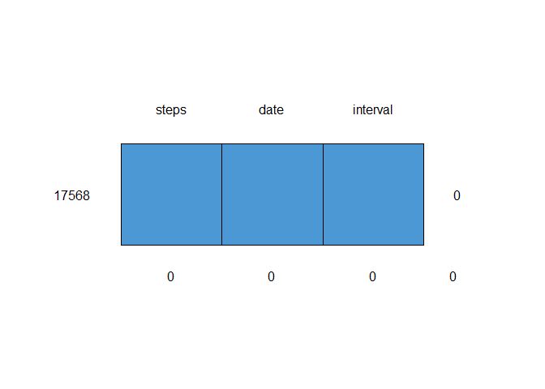

#Loading and preprocessing the data  
# Zip file download from coursera and unzip in the working directory.  


```r
temp <- tempfile()
download.file("https://d396qusza40orc.cloudfront.net/repdata%2Fdata%2Factivity.zip",temp)
unzip(temp)
unlink(temp)
df1<-read.csv("activity.csv")
```
  
## What is mean total number of steps taken per day?

### 1.Calculation of total number of steps taken per day


```r
library(readr)
library(dplyr)
```

```
## 
## Attaching package: 'dplyr'
```

```
## The following objects are masked from 'package:stats':
## 
##     filter, lag
```

```
## The following objects are masked from 'package:base':
## 
##     intersect, setdiff, setequal, union
```

```r
sumtable1<- df1 %>% group_by(date)%>%
                  filter(!is.na(steps))%>% 
                  summarise(SUM=sum(steps))
```

### 2. Histogram of total number of steps taken each day.

```r
hist(sumtable1$SUM,col="magenta")
```

<!-- -->

### 3.Calculate and report the mean and median of the total number of steps taken per day  

```r
summary(sumtable1)
```

```
##      date                SUM       
##  Length:53          Min.   :   41  
##  Class :character   1st Qu.: 8841  
##  Mode  :character   Median :10765  
##                     Mean   :10766  
##                     3rd Qu.:13294  
##                     Max.   :21194
```

## What is the average daily activity pattern?  

### 1. Time series plot (i.e. \color{red}{\verb|type = "l"|}type = "l") of the 5-minute   interval (x-axis) and the average number of steps taken, averaged across all days (y-axis).


```r
st1<-df1 %>% group_by(interval)%>%
  filter(!is.na(steps))%>% 
  summarise(SUM=mean(steps))
plot(st1,type="l",col="green")
```

<!-- -->

### 2. Which 5-minute interval, on average across all the days in the dataset, contains the maximum number of steps?

```r
st1%>% top_n(1,SUM)
```

```
## # A tibble: 1 × 2
##   interval   SUM
##      <int> <dbl>
## 1      835  206.
```

## Imputing missing values  

### 1. Total number of missing values in the dataset.


```r
library(mice)
```

```
## 
## Attaching package: 'mice'
```

```
## The following object is masked from 'package:stats':
## 
##     filter
```

```
## The following objects are masked from 'package:base':
## 
##     cbind, rbind
```

```r
md.pattern(df1)
```

<!-- -->

```
##       date interval steps     
## 15264    1        1     1    0
## 2304     1        1     0    1
##          0        0  2304 2304
```

### 2. Strategy for filling in all of the missing values in the dataset.

Adopted strategy: mean calculated for each 5-minute interval and replaced with NAs accordingly.As initial step summary table of each interval and mean value of steps made and put the same into dataframe : df2.


```r
df2<-df1%>%group_by(interval) %>%
    filter(!is.na(steps))%>%
    summarise(avg=mean(steps))
```

### 3. Creation of a new dataset that is equal to the original dataset but with the missing data filled in.

df3 dataframe is made using left_join and coalesce function of dplyr package.  


```r
df3<- df1%>%
      left_join(df2,by="interval")%>%
      mutate(steps=coalesce(steps,avg))%>%
      select(steps,date,interval)
head(df3)
```

```
##       steps       date interval
## 1 1.7169811 2012-10-01        0
## 2 0.3396226 2012-10-01        5
## 3 0.1320755 2012-10-01       10
## 4 0.1509434 2012-10-01       15
## 5 0.0754717 2012-10-01       20
## 6 2.0943396 2012-10-01       25
```

```r
md.pattern(df3)
```

```
##  /\     /\
## {  `---'  }
## {  O   O  }
## ==>  V <==  No need for mice. This data set is completely observed.
##  \  \|/  /
##   `-----'
```

<!-- -->

```
##       steps date interval  
## 17568     1    1        1 0
##           0    0        0 0
```


### 4. Make a histogram of the total number of steps taken each day and Calculate and report the mean and median total number of steps taken per day. 


```r
sumtable2<- df3 %>% 
            group_by(date)%>%
            summarise(SUM=sum(steps))
hist(sumtable2$SUM,col="orange")
```

<!-- -->

Calculation and reporting of mean value.


```r
summary(sumtable2)
```

```
##      date                SUM       
##  Length:61          Min.   :   41  
##  Class :character   1st Qu.: 9819  
##  Mode  :character   Median :10766  
##                     Mean   :10766  
##                     3rd Qu.:12811  
##                     Max.   :21194
```

Impact of imputing missing data on the estimates of the total daily number of steps were seemed negligible only median increased by 1, histogram looks very similar and mean not changed.

## Are there differences in activity patterns between weekdays and weekends?

### 1. Creation of new factor variable with two levels, weekday and weekend.  

At first convert date column into Date type using as. Date function.  
Second step, using mutate fuction of deplyr, weekdays() , and if ele create Day variable.  

Thirdly convert Day variable from character to factor using as.factor function.


```r
df3$date<-as.Date(df3$date)
df4<-df3 %>% mutate(Day=ifelse(weekdays(date)=="Sunday" | weekdays(date)=="Saturday",
               "weekend","weekday"))
df4$Day<-as.factor(df4$Day)
str(df4)
```

```
## 'data.frame':	17568 obs. of  4 variables:
##  $ steps   : num  1.717 0.3396 0.1321 0.1509 0.0755 ...
##  $ date    : Date, format: "2012-10-01" "2012-10-01" ...
##  $ interval: int  0 5 10 15 20 25 30 35 40 45 ...
##  $ Day     : Factor w/ 2 levels "weekday","weekend": 1 1 1 1 1 1 1 1 1 1 ...
```

```r
summary(df4)
```

```
##      steps             date               interval           Day       
##  Min.   :  0.00   Min.   :2012-10-01   Min.   :   0.0   weekday:12960  
##  1st Qu.:  0.00   1st Qu.:2012-10-16   1st Qu.: 588.8   weekend: 4608  
##  Median :  0.00   Median :2012-10-31   Median :1177.5                  
##  Mean   : 37.38   Mean   :2012-10-31   Mean   :1177.5                  
##  3rd Qu.: 27.00   3rd Qu.:2012-11-15   3rd Qu.:1766.2                  
##  Max.   :806.00   Max.   :2012-11-30   Max.   :2355.0
```

### 2. Make a panel plot containing a time series plot (i.e. type = "l") of the 5-minute interval (x-axis) and the average number of steps taken, averaged across all weekday days or weekend days (y-axis). 


```r
library(ggplot2)
sumtable3<- df4 %>% 
  group_by(interval,Day)%>%
  summarise(avg=mean(steps))
```

```
## `summarise()` has grouped output by 'interval'. You can override using the
## `.groups` argument.
```

```r
ggplot(sumtable3,aes(interval,avg))+
  geom_line(color = "steelblue", size = 0.5)+
  facet_wrap(~Day,dir="v")
```

<!-- -->


